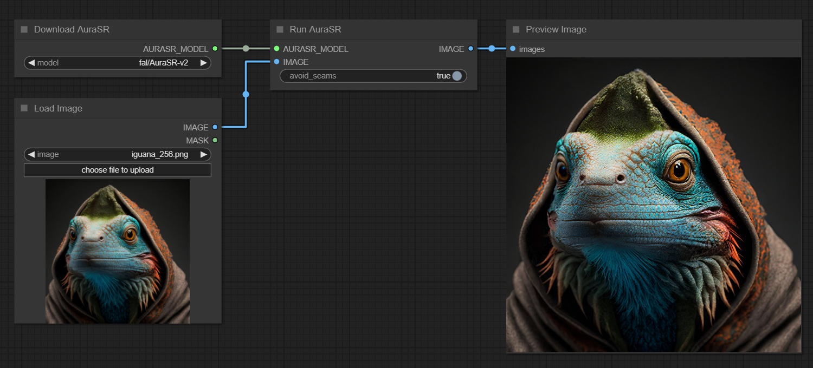

# ComfyUI AuraSR

Custom ComfyUI nodes to run [fal-ai/AuraSR](https://huggingface.co/fal-ai/AuraSR) model.

## Getting Started

Go to the ComfyUI folder `.\ComfyUI\custom_nodes` and clone this repository: `git clone https://github.com/alexisrolland/ComfyUI-AuraSR.git`

Install the Python dependencies:

```sh
..\..\python_embeded\python.exe -s -m pip install -r .\ComfyUI-AuraSR\requirements.txt
```

### Example

Download this image and import it in ComfyUI to load the workflow.

