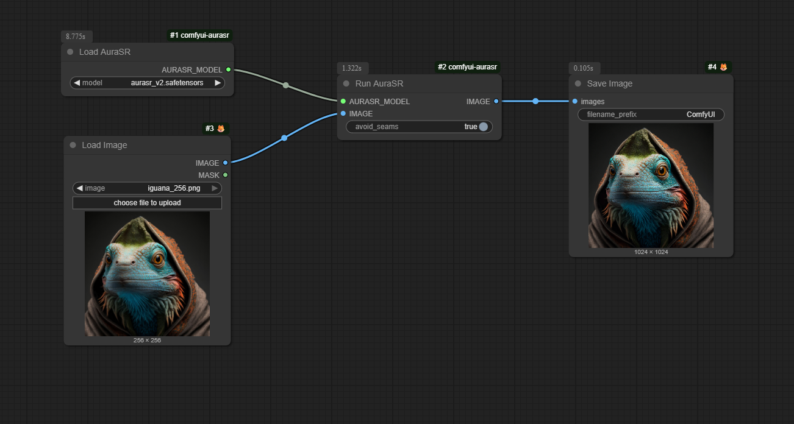

# ComfyUI-AuraSR

Custom nodes to run AuraSR models created by Fal AI. The original models and code are in the following repositories:

- [fal/AuraSR](https://huggingface.co/fal/AuraSR)
- [fal/AuraSR-v2](https://huggingface.co/fal/AuraSR-v2)

## Getting Started

Download the model files manually from the [Lexius/AuraSR](https://huggingface.co/Lexius/AuraSR) and place them in the ComfyUI folder `.\ComfyUI\models\upscale_models`:

- [aurasr.safetensor](https://huggingface.co/Lexius/AuraSR/blob/main/aurasr.safetensors)
- [aurasr_v2.safetensor](https://huggingface.co/Lexius/AuraSR/blob/main/aurasr_v2.safetensors)

Go to the ComfyUI folder `.\ComfyUI\custom_nodes`, clone this repository and install Python dependencies:

```sh
# Clone repo
git clone https://github.com/alexisrolland/ComfyUI-AuraSR.git

# Install dependencies
..\..\python_embeded\python.exe -s -m pip install -r .\ComfyUI-AuraSR\requirements.txt
``` 

## Example

